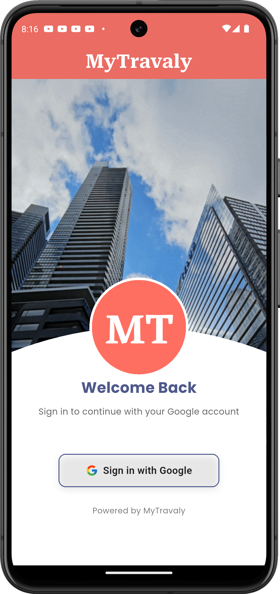
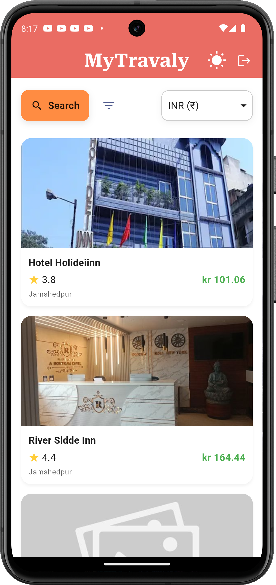
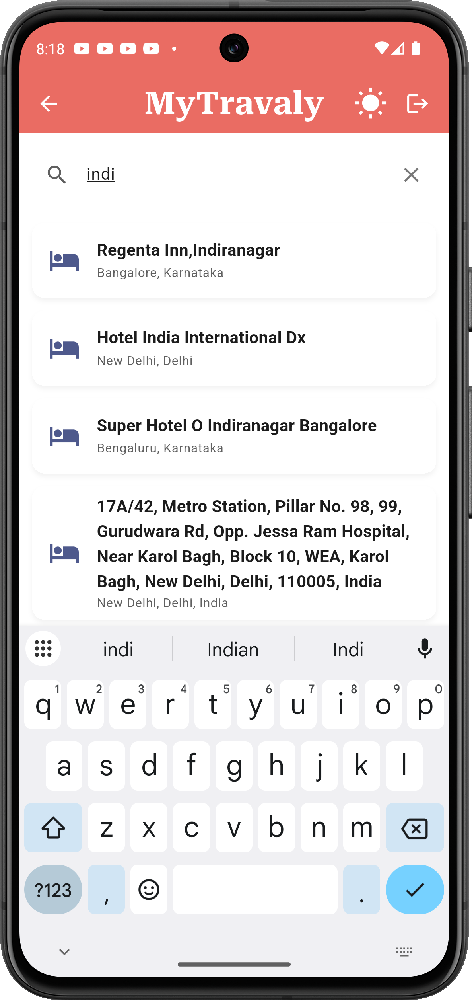
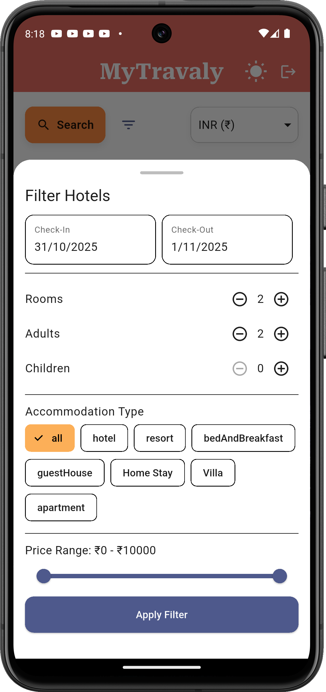
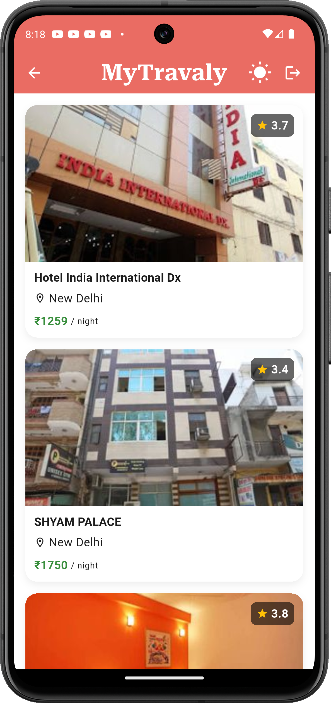
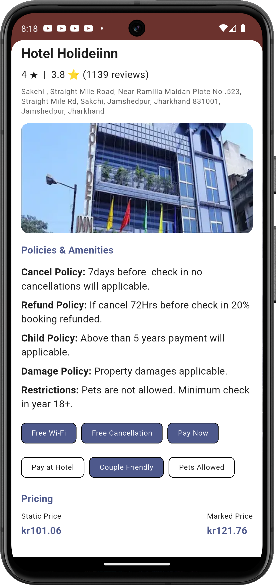
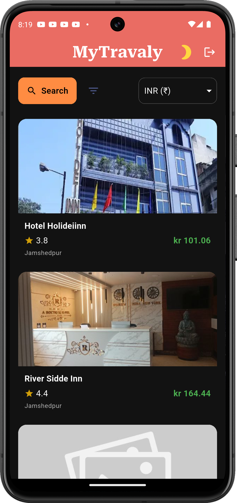

# MyTravaly Flutter Assessment

A Flutter application developed as part of the **MyTravaly Assessment**, implementing all APIs shared in the Postman collection with additional enhanced features such as **Dark Mode**, **Dynamic Currency Selection**, and **Device Registration**.  
The app follows a **clean MVVC architecture** and is well-structured for scalability and maintainability.

---

## 🚀 Features

- ✅ Implemented all required APIs (as per shared Postman collection)
- 🌙 Dark & Light Theme Support (with persistent user preference)
- 💱 Dynamic Currency Selection
- 📱 Device Registration API integration
- 🧩 MVVC Architecture for clean separation of concerns
- ⚙️ Shared Preferences for local data persistence
- 📡 Real-time API handling with proper error and loading states
- 💅 Modern and adaptive UI with theme responsiveness

---

## 🛠️ Tech Stack

- **Framework:** Flutter (Dart)
- **State Management:** Provider
- **Architecture:** MVVC (Model-View-ViewController)
- **Local Storage:** Shared Preferences
- **API Integration:** HTTP (RESTful APIs)
- **Theme Management:** Provider with persistent theme storage

---

## 📦 Installation Guide

1. **Clone the repository**
   ```bash
   git clone https://github.com/No0b-master/MyTravaly_flutter_assesment.git
   
2. **Navigate to project directory**

   ```bash
   cd MyTravaly_flutter_assesment
   

3. **Get dependencies**

   ```bash
   flutter pub get


4. **Run the app**

   ```bash
   flutter run


---

## 📲 APK Download

You can directly install and test the app using the pre-built APK:

**[Download APK – MyTravaly_v1.apk](./APK/mytravaly_v1.apk)**

---

## 👨‍💻 Developer

**Ahmad Mohd**
📧 [ahmadaug20@gmail.com](mailto:ahmadaug20@gmail.com)
🔗 [LinkedIn Profile](https://www.linkedin.com/in/ahmad-mohd)
💻 [GitHub Profile](https://github.com/No0b-master)

---

## 🧠 Notes

* The project was developed with attention to clean architecture and maintainable code practices.
* Each feature and API is modularized for easy scalability.
* Proper error handling and response management are implemented throughout the app.

---

## 📸 Screenshots

    
 


---


⭐ **If you like this project, please give it a star on GitHub!**

```

